# Dispatch Relationships

This diagram illustrates the action dispatch flow across the March Hare example
application. The example exposes four routed surfaces (`/`, `/cats/*`,
`/transactions`, `/test/strict-mode`) and each one demonstrates a different
distribution mode and integration pattern (Resource fetcher, multicast scope,
broadcast, `EventSource`, router-driven mount).

```mermaid
flowchart TB
    subgraph Router["🧭 Routes (src/example/index.tsx)"]
        RouteHome["/ → App"]
        RouteCats["/cats/* → Cats"]
        RouteTx["/transactions → Transactions"]
        RouteStrict["/test/strict-mode → StrictModeTest"]
    end

    subgraph Global["🌐 Global Broadcasts"]
        Fault["Lifecycle.Fault\n(singleton broadcast)"]
        Store["Lifecycle.Store\n(singleton broadcast)"]
        TxLoaded["BroadcastActions.TransactionsLoaded\n(transactions/types.ts)"]
    end

    subgraph AppPage["🏠 App (app/index.tsx)"]
        AppHandler["useAction(Lifecycle.Fault)\n→ message.warning / info / error"]
        AppKids["renders Visitor + Counter + Mood"]
    end

    subgraph CounterFeat["📊 Counter — User refresher (counter/)"]
        CounterMount["Lifecycle.Mount()"]
        CounterUser["Actions.User"]
        CounterResource["context.actions.resource(resource.user())"]
        CounterBtn["↻ Refresh button"]
        CounterModel["model.user"]
    end

    subgraph VisitorFeat["👤 Visitor — SSE feed (visitor/)"]
        VisitorMount["Lifecycle.Mount()"]
        VisitorUnmount["Lifecycle.Unmount()"]
        VisitorAction["Actions.Visitor"]
        EventSrc["EventSource('/visitors')\nlisteners: connected / visitor / error"]
        VisitorModel["model.visitor + model.history"]
    end

    subgraph MoodFeat["🎭 Mood — multicast scope (mood/)"]
        MoodScope["Scope.Mood\nAction(Distribution.Multicast)"]
        HappySelect["Happy: Actions.Select"]
        SadSelect["Sad: Actions.Select"]
        HappyModel["Happy: model.selected"]
        SadModel["Sad: model.selected"]
    end

    subgraph CatsFeat["🐱 Cats — router-driven (cats/components/cat/)"]
        CatMount["Lifecycle.Mount()"]
        CatGet["Actions.Get"]
        CatNext["Actions.Next"]
        CatPrev["Actions.Previous"]
        CatGetCat["catHandler\n(reads context.data.index)"]
        CatRouter["context.data.router.navigate(...)"]
        CatModel["model.cat"]
    end

    subgraph TxFeat["💳 Transactions — broadcast + Resource (transactions/)"]
        TxMount["Lifecycle.Mount()"]
        TxLoadMore["Actions.LoadMore\n(IntersectionObserver)"]
        TxRefresh["Actions.Refresh"]
        TxResource["context.actions.resource(resource.transactions({cursor}))"]
        TxModel["model.items + model.cursor + model.hasMore\n(annotate Op.Update while pending)"]
    end

    subgraph StrictFeat["🧪 Strict-mode fixture (strict-mode-test/)"]
        StrictMount["Lifecycle.Mount() → mountCountRef++"]
        StrictSet["Actions.SetName → model.name"]
        StrictInc["Actions.Increment → model.count"]
    end

    %% Routing
    RouteHome --> AppPage
    RouteCats --> CatsFeat
    RouteTx --> TxFeat
    RouteStrict --> StrictFeat

    %% App embeds the demo trio
    AppPage --> CounterFeat
    AppPage --> VisitorFeat
    AppPage --> MoodFeat

    %% Counter flow
    CounterMount -->|"dispatch()"| CounterUser
    CounterBtn -->|"dispatch()"| CounterUser
    CounterUser -->|"resource()"| CounterResource
    CounterResource -->|"produce()"| CounterModel

    %% Visitor flow
    VisitorMount -->|"new EventSource"| EventSrc
    EventSrc -->|"'visitor' event ⇒ dispatch()"| VisitorAction
    VisitorAction -->|"produce()"| VisitorModel
    VisitorUnmount -->|"source.close()"| EventSrc

    %% Mood multicast — both children dispatch + subscribe via Scope.Mood
    HappySelect -->|"dispatch(Scope.Mood)"| MoodScope
    SadSelect -->|"dispatch(Scope.Mood)"| MoodScope
    MoodScope -->|"useAction → produce()"| HappyModel
    MoodScope -->|"useAction → produce()"| SadModel

    %% Cats flow
    CatMount -->|"handler"| CatGetCat
    CatGet -->|"handler"| CatGetCat
    CatGetCat -->|"produce()"| CatModel
    CatNext -->|"router.navigate"| CatRouter
    CatPrev -->|"router.navigate"| CatRouter

    %% Transactions flow + broadcast
    TxMount -->|"resource() then dispatch()"| TxResource
    TxLoadMore -->|"resource() then dispatch()"| TxResource
    TxRefresh -->|"resource() then dispatch()"| TxResource
    TxResource -->|"produce()"| TxModel
    TxMount -.->|"dispatch broadcast"| TxLoaded
    TxLoadMore -.->|"dispatch broadcast"| TxLoaded
    TxRefresh -.->|"dispatch broadcast"| TxLoaded

    %% Faults bubble up to the App handler
    CounterFeat -.->|"timeout / error / supplant"| Fault
    VisitorFeat -.->|"timeout / error / supplant"| Fault
    MoodFeat -.->|"timeout / error / supplant"| Fault
    Fault -->|"useAction(Lifecycle.Fault)"| AppHandler

    %% Styling
    classDef route fill:#ede7f6,stroke:#4527a0,color:#4527a0
    classDef unicast fill:#e1f5fe,stroke:#01579b,color:#01579b
    classDef multicast fill:#f1f8e9,stroke:#33691e,color:#33691e
    classDef broadcast fill:#fff3e0,stroke:#e65100,color:#e65100
    classDef lifecycle fill:#f3e5f5,stroke:#7b1fa2,color:#7b1fa2
    classDef interaction fill:#e8f5e9,stroke:#2e7d32,color:#2e7d32
    classDef model fill:#fce4ec,stroke:#c2185b,color:#c2185b
    classDef resource fill:#fffde7,stroke:#f57f17,color:#f57f17

    class RouteHome,RouteCats,RouteTx,RouteStrict route
    class CounterUser,VisitorAction,CatGet,CatNext,CatPrev,TxLoadMore,TxRefresh,HappySelect,SadSelect,StrictSet,StrictInc unicast
    class MoodScope multicast
    class Fault,Store,TxLoaded broadcast
    class CounterMount,VisitorMount,VisitorUnmount,CatMount,TxMount,StrictMount,AppHandler lifecycle
    class CounterBtn,EventSrc,CatRouter,CatGetCat interaction
    class CounterModel,VisitorModel,HappyModel,SadModel,CatModel,TxModel model
    class CounterResource,TxResource resource
```

## Distribution Modes In Use

| Mode          | Where it appears                                                 | Notes                                                                                           |
| ------------- | ---------------------------------------------------------------- | ----------------------------------------------------------------------------------------------- |
| **Unicast**   | Counter, Visitor, Cat, Transactions, Strict-mode fixture         | Default. Only the dispatching component's handlers fire.                                        |
| **Multicast** | `Scope.Mood` in `mood/types.ts`                                  | Scope is the action itself. `withScope(Scope.Mood, Mood)` opens it; Happy + Sad both subscribe. |
| **Broadcast** | `BroadcastActions.TransactionsLoaded` in `transactions/types.ts` | Fired by `Mount`, `LoadMore`, `Refresh`. No subscriber in the demo — it's a wiring example.     |
| **Singleton** | `Lifecycle.Fault`, `Lifecycle.Store`                             | Library-level broadcasts, not per-component factories. App subscribes to `Lifecycle.Fault`.     |

## Surface Walk-through

### `/` — `App` (`app/index.tsx`)

Mounts `Visitor`, `Counter`, and `Mood`. The only handler it registers itself is
`Lifecycle.Fault`, which converts `Reason.Aborted` / `Reason.Errored`
faults into Ant Design toasts. Any unhandled fault in the
sub-trees bubbles up through the singleton broadcast.

### `/` — `Counter` (`counter/`)

Despite the historical name, this component refreshes the current **User**:

1. `Lifecycle.Mount()` dispatches `Actions.User`.
2. `Actions.User` calls `context.actions.resource(resource.user())` to fetch via the
   `Resource` primitive (see `recipes/use-resource.md`) and writes the result to
   `model.user` with `produce()`.
3. The refresh button re-dispatches `Actions.User`.

### `/` — `Visitor` (`visitor/`)

Real-time feed driven by an `EventSource`:

- `Lifecycle.Mount()` opens `new EventSource("/visitors")` and stores it on the
  model so the unmount handler can close it.
- The `"connected"` listener flips `model.connected`; the `"visitor"` listener
  parses the payload and `dispatch(Actions.Visitor, country)`.
- `Actions.Visitor` updates `model.visitor` and prepends to `model.history`
  (capped at 20 entries via `A.take`).
- `Lifecycle.Unmount()` calls `source.close()`.

### `/` — `Mood` (`mood/`)

Multicast scope demo:

- `withScope(Scope.Mood, Mood)` wraps `<Happy />` + `<Sad />` in a shared scope
  keyed by the action itself — no separate scope name.
- Each child has a local `Actions.Select`. Its handler dispatches
  `Scope.Mood` (multicast), which both children subscribe to via
  `actions.useAction(Scope.Mood, ...)`. The end result is that clicking either
  card updates `model.selected` in **both** components, so the UI dims the
  unselected card.

### `/cats/*` — `Cat` (`cats/components/cat/`)

Router-driven Resource fetch:

- Wrapped in a top-level `<Boundary>` and a Wayfinder `<Router>`.
- `Actions.Mount` and `Actions.Get` both run the `catHandler`, which reads
  `context.data.index` and writes the fetched cat to `model.cat`.
- `Actions.Next` / `Actions.Previous` are pure navigation: they read
  `context.data.router` (passed via the third generic `Data`) and call
  `router.navigate(router.url(urls.cat, { index }))`. The route change causes
  the new index to flow back through `context.data`, which triggers a fresh
  fetch.

### `/transactions` — `Transactions` (`transactions/`)

Cursor-paginated list with annotation-driven loading state:

- `Lifecycle.Mount()` annotates `model.items` with `Operation.Update`, awaits
  `transactions({ cursor: null })`, broadcasts
  `BroadcastActions.TransactionsLoaded`, then writes the page into the model.
- `Actions.LoadMore` is dispatched by an `IntersectionObserver` on a sentinel
  div; it short-circuits when `inspect.items.pending()` is true so concurrent
  scrolls don't queue duplicate fetches.
- `Actions.Refresh` resets the cursor.
- All three handlers dispatch `BroadcastActions.TransactionsLoaded` after a
  successful fetch — demonstrating the broadcast wire even though nothing
  currently subscribes to it.

### `/test/strict-mode` — `StrictModeTest` (`strict-mode-test/`)

Test fixture, not part of the runtime demo. Confirms that `Lifecycle.Mount` and
handler bodies are not double-invoked under `<React.StrictMode>`.

## Action Registry

### Counter (`counter/types.ts`)

- `Actions.Mount` — `Lifecycle.Mount()`
- `Actions.User` — fetches the user via the `Resource` API

### Visitor (`visitor/types.ts`)

- `Actions.Mount` — `Lifecycle.Mount()`
- `Actions.Unmount` — `Lifecycle.Unmount()`
- `Actions.Visitor` — receives a `Country` from the SSE feed
- `Actions.Broadcast` — re-export of the legacy `BroadcastActions` namespace
  (declared but no longer dispatched or subscribed)

### Mood (`mood/types.ts`)

- `Scope.Mood` — multicast `Action<Mood>` shared by Happy and Sad

### Happy / Sad (`mood/components/happy|sad/types.ts`)

- `Actions.Select` — local unicast; its handler republishes via `Scope.Mood`

### Cat (`cats/components/cat/types.ts`)

- `Actions.Mount`, `Actions.Get`, `Actions.Next`, `Actions.Previous`

### Transactions (`transactions/types.ts`)

- `Actions.Mount`, `Actions.LoadMore`, `Actions.Refresh`
- `BroadcastActions.TransactionsLoaded` — broadcast `Action<Transaction[]>`

### Strict-mode fixture (`strict-mode-test/index.tsx`)

- `Actions.Mount`, `Actions.SetName`, `Actions.Increment`

### Global (library)

- `Lifecycle.Fault` — singleton broadcast for handler timeouts, supplants, and
  errors. Subscribed in `app/index.tsx`.
- `Lifecycle.Store` — singleton broadcast emitted when the `<Boundary store>`
  changes. Not currently subscribed to in the example.
